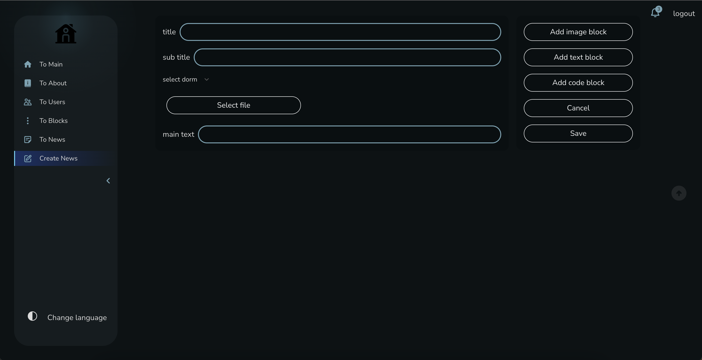
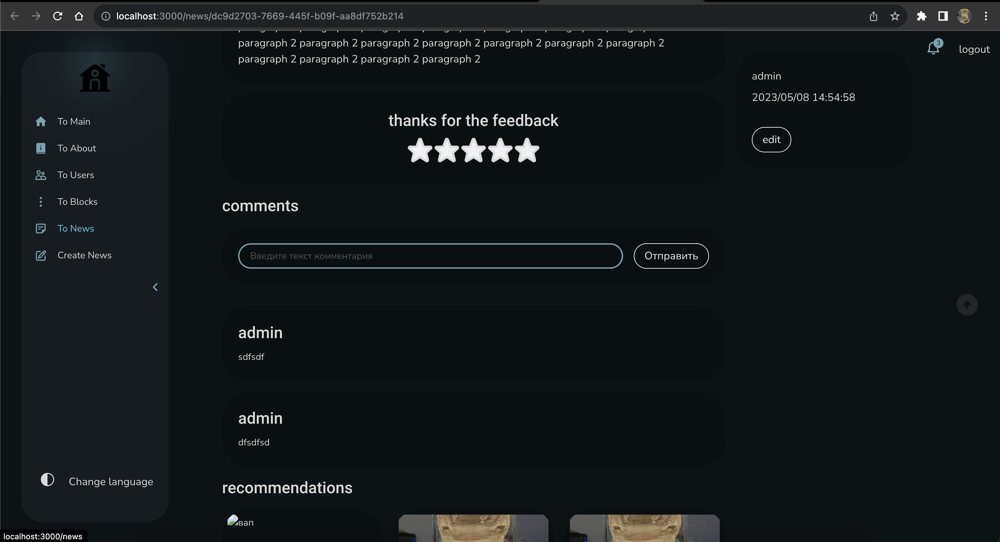
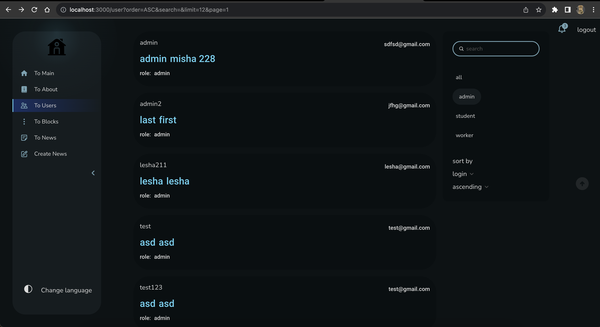
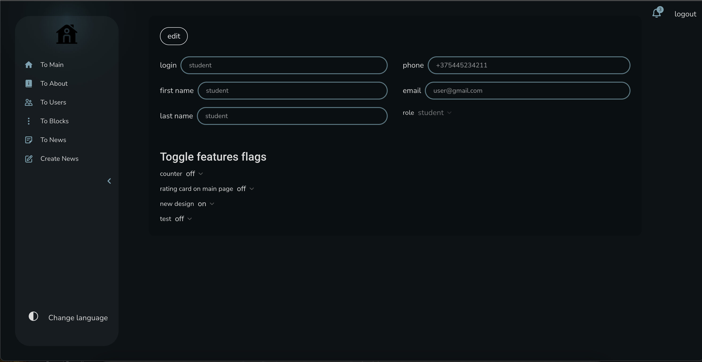

# Road

## Description

Road - Front-end part of dorm-management system. Back-end part you can find [here.](https://github.com/FURY-PERSON/bds)

This project is developed using [React.js](https://react.dev/) and implements the [feature slices design](https://feature-sliced.design/) methodology. Using in project feature flags approach. [See all flags.](src/shared/lib/helpers/features/lib/featureFlag.ts). The app supports internationalization, themes, roles features. In the app there are two designs - old and new. You can switch it via admin panel.

Project has developed for studying purposes to learn: Feature slised design, Webpack, Jest, Storybook, loki, cypress, ts-morph, code splitting, feature flag, roles handling and using as testing ground for new ideas.

## Get started

```bash
	npm install
```

### Dev Scripts
- Start proj in dev mode using webpack.
```bash
  npm run start:dev:front
```
- Start proj in dev mode using vite.
```bash
  npm run start:dev:vite:front
```
- Start proj in dev mode using webpack and fake json server.
```bash
  npm run start:dev:project
```

### Build Scripts
- Generate bundle with dev env.
```bash
  npm run build:dev
```
- Generate bundle with prod env.
```bash
  npm run build:prod
```

## Architecture

App implemented using [feature slices design](https://feature-sliced.design/) methodology.

## Documentation

For UI documentation using [storybook](https://storybook.js.org/tutorials/intro-to-storybook/react/en/get-started/).

- Start storybook in dev mode.
```bash
  npm run documentation:storybook:dev
```
- Generate storybook bundle.
```bash
  npm run documentation:storybook:build
```

## Test

- To run all tests use
```bash
	npm run test:all
```

### Unit

Using [Jest](https://jestjs.io/) with [testing-library/react](https://testing-library.com/docs/react-testing-library/intro/).

- Run unit tests.
```bash
	npm run test:unit
```

### e2e

Using [cypress](https://www.cypress.io/).  

- To open cypress project run:
```bash
	npm run test:e2e
```

### Screenshot

Using [loki](https://loki.js.org/) and [storybook](https://storybook.js.org/addons/loki) to make snapshot from each storybook case.

- Run tests:
```bash
  npm run test:ui
```

- Approve ui changes:
```bash
  npm run test:ui:approve
```

- Generate ui changes report:
```bash
	npm run test:ui:report
```

## Utils

### EsLint

- Check Eslint errors.
```bash
	npm run lint:ts:check
```

- Fix Eslint errors.
```bash
	npm run lint:ts:fix
```

### Prettier

eslint + prettier for formatting code [https://prettier.io/docs/en/integrating-with-linters.html](using eslint-plugin-prettier).

> duplicate prettier config in the .eslintrc.js rules "prettier/prettier" to avoid conflicts between global config and project.
> highly recommended to setup your IDE to run lint:fix command on save file. (Current project has set up for vsCode, no additional actions need not).

### App Screenshots

> Create news page


> News feedback


> Users page


> Edit users page
